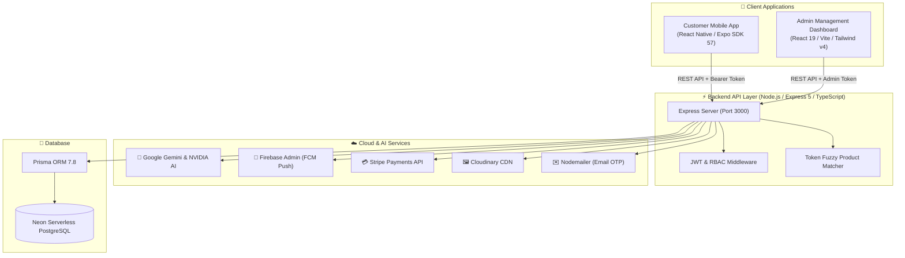

<div align="center">

# 🛒 MKB-Smart

### *Next-Generation AI-Driven Smart Grocery & Recipe E-Commerce Platform*

<p align="center">
  <b>MKB-Smart</b> transforms ordinary grocery shopping into an intelligent, culinary-guided experience.<br/>
  Featuring a <b>voice-enabled AI Chef</b> that generates recipes and instantly matches ingredients to real in-store stock,<br/>
  combined with a <b>full-fledged RBAC Admin Management Suite</b> and real-time <b>FCM push notifications</b>.
</p>

<p align="center">
  <a href="#-key-features"><b>✨ Key Features</b></a> •
  <a href="#️-system-architecture"><b>🏛️ Architecture</b></a> •
  <a href="#-technology-stack"><b>💻 Tech Stack</b></a> •
  <a href="#-project-structure"><b>📁 Project Structure</b></a> •
  <a href="#-api-endpoints-reference"><b>📡 API Reference</b></a> •
  <a href="#-troubleshooting--tips"><b>💡 Troubleshooting</b></a>
</p>

</div>

---

## ✨ Key Features

### 📱 1. Customer Mobile App `(React Native & Expo SDK 57)`

* 🎙️ **Voice & AI Recipe Generator:** Speak or type recipe ideas. Powered by Gemini & NVIDIA AI, the assistant outputs detailed recipes with precise serving weights and instructions.
* 🛒 **Smart Recipe-to-Cart Matcher:** Proprietary token fuzzy-matching algorithm analyzes generated recipe ingredients and directly finds matching items in the store's live inventory, allowing single-click cart additions.
* 🏷️ **Rich Grocery Catalog:** Dynamic category browsing, organic verification badges, instant search, price comparisons, and wishlist/favorites.
* 📍 **Geolocation Address Manager:** Pin multiple delivery locations with exact latitude/longitude coordinates and phone contact info.
* 💳 **Seamless Payments:** Support for Stripe Credit/Debit Card checkout and Cash on Delivery (COD).
* 📦 **Live Order Lifecycle:** Real-time visual tracking from `Placed` ➔ `Processing` ➔ `Shipped` ➔ `Delivered`.
* 🔔 **Push Notifications:** Integrated Firebase Cloud Messaging (FCM) keeps shoppers updated on order status changes, delivery milestones, and out-of-stock items.
* 🔐 **Secure Auth & Recovery:** JWT-authenticated accounts, avatar customization, and password recovery with 6-digit email OTP verification.

---

### 💻 2. Admin & Super Admin Web Portal `(React 19 & Vite)`

* 👥 **Multi-Tier RBAC:** Strict Role-Based Access Control separating `ADMIN` and `SUPER_ADMIN` operations with account approval gates.
* 📊 **Visual Revenue Analytics:** Interactive charts powered by Recharts displaying sales trends, top-selling categories, and revenue breakdowns.
* 📦 **Complete Inventory Control:** Add, edit, manage stock counts, set organic flags, and upload high-resolution product photography via Cloudinary.
* 📑 **Order Dispatch & Fulfillment:** Advance orders through fulfillment stages, automatically triggering customer push notifications at each step.
* 📄 **Instant PDF Reports & Invoices:** Client-side invoice and dispatch slip generation using jsPDF.
* 🛡️ **Administrative Security:** Super Admins can review, activate, or suspend administrative users.

---

### 🧠 3. Backend & Intelligent Engine `(Express 5 & TypeScript)`

* 🤖 **Dual LLM Intelligence:** Leverages Google Gemini 2.x (`@google/genai`) and NVIDIA Foundation Models for cooking guidance and structured JSON recipe outputs.
* 🔍 **Deterministic Fuzzy Matcher:** Custom token matching pipeline that strips filler marketing words, normalizes irregular plurals, and prevents false matches on packaging terms.
* 🐘 **Serverless PostgreSQL:** Connected via Prisma ORM to Neon Serverless PostgreSQL with connection pooling and graceful pool shutdown.
* 📬 **Multi-Recipient Push Service:** FCM dispatcher supporting individual shoppers, system admins, and super admins.
* ✉️ **Automated SMTP Delivery:** Nodemailer transport for transactional emails, order confirmations, and OTPs.

---

## 🏛️ System Architecture



---

## 💻 Technology Stack

| Domain | Technology | Version | Purpose |
| :--- | :--- | :--- | :--- |
| **Mobile App** | [Expo](https://expo.dev) / [React Native](https://reactnative.dev) | `SDK 57` / `0.86` | Cross-platform iOS, Android, and Web application |
| | [Expo Router](https://docs.expo.dev/router/introduction/) | `~57.0.20` | File-system based typed navigation |
| | [NativeWind](https://www.nativewind.dev/) / [Tailwind CSS](https://tailwindcss.com) | `v4` / `v3.4` | Utility-first mobile styling |
| | [Stripe React Native](https://github.com/stripe/stripe-react-native) | `0.64.0` | In-app secure mobile payment processing |
| | [Expo Speech Recognition](https://github.com/jamsch/expo-speech-recognition) | `^56.0.1` | Voice-to-text AI recipe generation |
| | [Reanimated](https://docs.swmansion.com/react-native-reanimated/) | `4.5.1` | Fluid 60fps micro-animations |
| **Admin Web** | [React 19](https://react.dev) + [Vite](https://vitejs.dev) | `19.2` / `8.0` | High-performance Single Page Application |
| | [Tailwind CSS](https://tailwindcss.com) | `v4.2.2` | Modern, token-based responsive UI styling |
| | [Recharts](https://recharts.org) | `3.8.1` | Data visualization and sales revenue graphs |
| | [jsPDF](https://github.com/parallax/jsPDF) | `4.2.1` | Client-side invoice and report generation |
| | [Lucide React](https://lucide.dev) | `^1.17.0` | Consistent iconography |
| **Backend** | [Node.js](https://nodejs.org) + [Express](https://expressjs.com) | `Node 20+` / `5.2` | RESTful API server with TypeScript |
| | [TypeScript](https://www.typescriptlang.org) / [tsx](https://github.com/privatenumber/tsx) | `5.x` / `4.22` | Type-safe runtime execution & hot-reload |
| | [Prisma ORM](https://www.prisma.io) | `7.8.0` | Type-safe PostgreSQL client & migrations |
| | [Neon PostgreSQL](https://neon.tech) | `Serverless` | Cloud-native scalable relational database |
| | [Google Gemini](https://ai.google.dev) & [NVIDIA](https://build.nvidia.com) | `2.x API` | Conversational AI and structured recipe JSON |
| | [Firebase Admin SDK](https://firebase.google.com) | `14.1.0` | FCM mobile push notification dispatch |
| | [Cloudinary](https://cloudinary.com) | `2.10.0` | Cloud media asset optimization and storage |

---

## 📁 Project Structure

```text
MKB-Smart/
├── backend/                       # Express 5 + TypeScript REST API
│   ├── configs/                   # Cloudinary, Stripe, Prisma & Firebase configs
│   ├── controllers/               # Route logic (Auth, AI, Products, Orders, etc.)
│   ├── middleware/                # JWT UserAuth & AdminAuth RBAC guards
│   ├── prisma/                    # PostgreSQL schema definition (schema.prisma)
│   ├── routes/                    # API Route endpoints
│   ├── services/                  # Gemini AI, NVIDIA AI, Token Fuzzy Matcher, FCM
│   ├── .env.example               # Backend environment template
│   ├── package.json
│   └── server.ts                  # Server entrypoint & CORS configuration
│
├── adminFrontend/                 # React 19 + Vite Admin Dashboard
│   ├── src/
│   │   ├── components/            # Sidebar, Navbar, Notification drawer
│   │   ├── pages/
│   │   │   ├── admin/             # Admin dashboard & profile
│   │   │   ├── superadmin/        # SuperAdmin dashboard, user & admin controls
│   │   │   ├── common/            # Shared Products, Inventory, Orders, Categories
│   │   │   └── auth/              # Admin Login, Sign Up, Password recovery
│   │   ├── config/api.ts          # Axios API client
│   │   └── App.tsx                # Route guards & RBAC routing
│   ├── .env.example               # Admin environment template
│   ├── vite.config.js
│   └── package.json
│
└── frontend/                      # Expo SDK 57 Cross-Platform Mobile App
    ├── app/                       # Expo Router file-based screens
    │   ├── (tabs)/                # Bottom tabs: Home, AI Chef, Cart, Orders, Profile
    │   ├── product/[id].tsx       # Product details & ratings
    │   ├── category/[slug].tsx    # Categorized product lists
    │   ├── GroceryHistoryChat.tsx # Past AI recipes & interactive cooking chat
    │   └── _layout.tsx            # Global stack & modal layout
    ├── src/
    │   ├── components/            # Voice assistant, cards, category chips, banners
    │   ├── context/               # Auth, Cart, Favorites, Address state providers
    │   └── utils/                 # FCM device token registration & helpers
    ├── .env.example               # Mobile environment template
    ├── app.json                   # Expo configuration & app permissions
    └── package.json
```

---

## 📡 API Endpoints Reference

### 🔐 Authentication `(/api/auth)`

| Method | Endpoint | Description | Auth Required |
| :---: | :--- | :--- | :---: |
| `POST` | `/api/auth/register` | Register new customer account | No |
| `POST` | `/api/auth/login` | Authenticate customer & return JWT | No |
| `POST` | `/api/auth/forgot-password` | Send 6-digit OTP to user's email | No |
| `POST` | `/api/auth/verify-otp` | Verify email OTP code | No |
| `POST` | `/api/auth/reset-password` | Reset password using verified OTP | No |
| `POST` | `/api/auth/admin/login` | Admin & SuperAdmin login | No |
| `POST` | `/api/auth/admin/register` | Register new Admin account (Pending status) | No |

---

### 🥦 Products & Catalog `(/api/products & /api/categories)`

| Method | Endpoint | Description | Auth Required |
| :---: | :--- | :--- | :---: |
| `GET` | `/api/products` | Retrieve products (with filtering, category & stock) | No |
| `GET` | `/api/products/:id` | Fetch single product details | No |
| `POST` | `/api/products` | Create product (with Cloudinary image upload) | Admin |
| `PUT` | `/api/products/:id` | Update product information and stock level | Admin |
| `DELETE` | `/api/products/:id` | Remove product from store catalog | Admin |
| `GET` | `/api/categories` | List all grocery categories | No |
| `POST` | `/api/categories` | Add a new category | Admin |

---

### 🤖 AI Kitchen Chef `(/api/ai)`

| Method | Endpoint | Description | Auth Required |
| :---: | :--- | :--- | :---: |
| `POST` | `/api/ai/generate-recipe` | AI-driven recipe generation & store item fuzzy match | Optional |
| `POST` | `/api/ai/chat` | Conversational kitchen cooking assistant | Optional |
| `GET` | `/api/ai/history` | Retrieve saved user recipe history | User (JWT) |
| `POST` | `/api/ai/history` | Save a generated recipe to history | User (JWT) |
| `DELETE` | `/api/ai/history/:id` | Delete recipe from user history | User (JWT) |

---

### 📦 Orders & Fulfillment `(/api/orders)`

| Method | Endpoint | Description | Auth Required |
| :---: | :--- | :--- | :---: |
| `POST` | `/api/orders` | Place order (Stripe Payment or COD) | User (JWT) |
| `GET` | `/api/orders/my-orders` | Fetch logged-in user's order history | User (JWT) |
| `GET` | `/api/orders` | List all orders with status filters | Admin |
| `PATCH` | `/api/orders/:id/status` | Update status (`PROCESSING`, `SHIPPED`, `DELIVERED`) | Admin |

---

### 📍 Addresses & Notifications `(/api/address & /api/notifications)`

| Method | Endpoint | Description | Auth Required |
| :---: | :--- | :--- | :---: |
| `GET` | `/api/address` | Get saved delivery addresses for user | User (JWT) |
| `POST` | `/api/address` | Save address with GPS lat/lng coordinates | User (JWT) |
| `DELETE` | `/api/address/:id` | Delete saved address | User (JWT) |
| `POST` | `/api/notifications/register-token` | Register FCM push notification token | User / Admin |
| `GET` | `/api/notifications` | Get user or admin notification list | User / Admin |

---

## 💡 Troubleshooting & Tips

> [!TIP]
> **Connecting Expo Go on Physical Phone to Local Backend**  
> Your phone and computer must be connected to the **same Wi-Fi network**. Inside `frontend/.env`, set `EXPO_PUBLIC_API_URL` to your computer's local IP address (e.g., `http://192.168.1.150:3000`) instead of `localhost`. Check your IP in Windows PowerShell with `ipconfig`.

> [!NOTE]
> **Prisma Connection Pooling on Hot-Reload**  
> The backend includes a singleton pattern on `globalThis` and graceful `SIGINT`/`SIGTERM` handlers in `configs/prisma.ts` to prevent *"Too many database connections"* errors during nodemon reloads.

> [!TIP]
> **Push Notifications Without Firebase Setup**  
> If `FIREBASE_SERVICE_ACCOUNT` is not configured in `backend/.env`, the server will safely enter **mock notification mode**, logging push alerts to the terminal rather than failing.

> [!IMPORTANT]
> **Email OTP Setup**  
> When using Gmail SMTP, generate a 16-character **App Password** under *Google Account Security ➔ 2-Step Verification ➔ App Passwords*. Standard Google passwords will be rejected by Google's SMTP servers.

---

## 📄 License

This project is licensed under the **ISC License**.

<br/>

<div align="center">
  <sub>Built with ❤️ by the <b>MKB-Smart</b> Development Team</sub>
</div>
